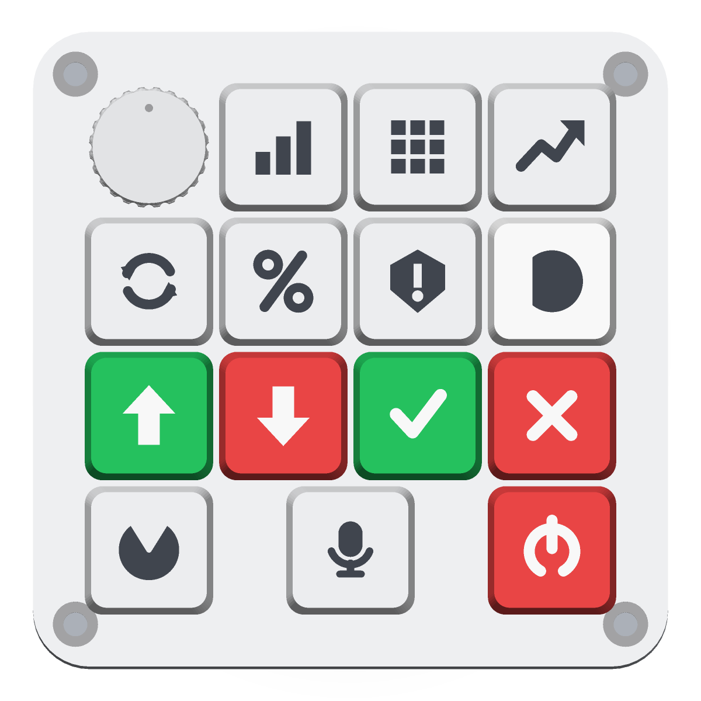

# xorr-pad

**An AI agent that trades on your desk.**

<div align="center">

</div>

A physical deck that runs an autonomous agent on **Base**, and **remembers** —
your risk limits, the positions you hold, and every rule it learned from your
yes/no — through [Sibyl Memory](https://github.com/Sibyl-Labs/Sibyl-Memory).

Delete the memory and it trades blind. That is not a slogan; it is
[a test](desktop/test/loadbearing.test.mjs) that runs the same signals with and
without the store and asserts the verdicts diverge.

## The deck

| | c0 | c1 | c2 | c3 |
|---|---|---|---|---|
| **r0** | 🎛 size knob | DCA | GRID | MOMENTUM |
| **r1** | REBALANCE | YIELD | RISK | ⬜ BASE |
| **r2** | 🟩 BUY | 🟥 SELL | 🟩 YES | 🟥 NO |
| **r3** | PORTFOLIO | 🎤 MIC | | 🟥 KILL |

Press an agent to take the baton, BUY/SELL to propose, YES/NO to answer — and
every yes/no teaches it. Hold MIC and just say *"buy fifty dollars of ETH"*.

## Run it

```bash
# 1. a Base mainnet fork — real contracts and liquidity, no real money
cd desktop && npm run fork

# 2. the desk app (hosts the backend the pad talks to)
npm install
CHAIN_MODE=fork PAD_TOKEN=xorrpad-dev npm start
```

It prints the LAN URL to type into the pad's captive portal. Point a browser at
`http://localhost:8080/?token=xorrpad-dev` if you'd rather drive it by hand —
**every pad key is clickable**, which matters because hand-soldered pads have
dead switches.

Prove the memory claim:

```bash
node desktop/test/loadbearing.test.mjs
```

## How a trade happens

```
memory ──▶ market ──▶ six agents ──▶ decide() ──▶ Uniswap on Base ──▶ journal
recall     real        propose        the gate      real signed tx     writeback
```

`decide()` is built only from what Sibyl remembers: it clamps to your cap,
vetoes anything matching a rule you accepted, refuses to sell a position it
cannot see, and subtracts today's spend from the journal.

## What's in here

| Path | What it is |
|---|---|
| `desktop/memory/sibyl_bridge.py` | the memory, over stdio JSON (Sibyl is Python-only) |
| `desktop/main/memory.mjs` | Node client — `recallBrief()` and the journal |
| `desktop/main/agents.mjs` | dca · grid · momentum · rebalance · yield · risk |
| `desktop/main/decide.mjs` | the gate where memory changes the trade |
| `desktop/main/dex.mjs` | quotes and real swaps on Base |
| `desktop/main/reflect.mjs` | mines your yes/no history into rules you accept |
| `desktop/main/voice.mjs` | Deepgram speech + a brain that has read memory |
| `firmware/` | the ESP32-S3 sketch, and `keytest` for wiring |
| `cad/` | the enclosure, parametric — `python assembly.py` rebuilds every STL |

## Hardware

ESP32-S3, 14 MX switches, INMP441 mic, MAX98357A amp + speaker. Wiring and pin
map in [`firmware/README.md`](firmware/README.md); dimensions in
[`SPEC.md`](SPEC.md). Caps print in three filaments —
`exports/print/xorr-pad-keycaps.3mf` opens straight in Bambu Studio.

`firmware/keytest` maps a hand-soldered matrix for you: it names each key, you
press it, and it prints a paste-ready `KEYMAP` — plus it beeps per key so you
can hear a dead switch.

## Status

- [x] enclosure, caps, 3MF
- [x] Sibyl memory + the load-bearing proof
- [x] Base fork, real Uniswap fills
- [x] six agents, `decide()`, kill switch
- [x] desk app, voice, firmware
- [ ] finish the key sweep (one dead switch, row 3 unswept)
- [ ] 1inch route (needs an API key)
- [ ] Virtuals

MIT. See [`PLAN.md`](PLAN.md) for the full build plan and
[`SUBMISSION.md`](SUBMISSION.md) for the memory writeup.
